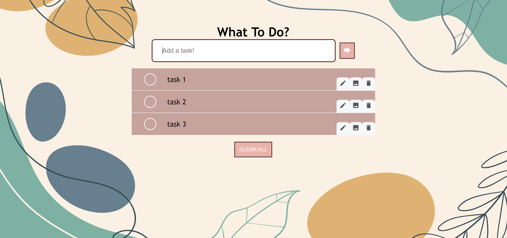

# WhatToDo?

WhatToDo is a **to-do list application** to help you keep track of tasks to do.
It **optimizes planning and organization of tasks** including **editing tasks, adding images and marking task completion** with a simple and clean graphical user interface (GUI).

Head on over to the [WhatToDo](https://amylzting.github.io/whattodo/).

# User Interface
WhatToDo uses a simple and clean user interface which does not distract from your important tasks.

# Main functionalities (and command shortcut):
1. Adding a task
2. Editing a task
3. Removing a task
4. Add image to a task
5. Mark a task as done
6. Clear all tasks

# User Guide
For more information about the usage of WhatToDo, please view the [WhatToDo User Guide](https://amylzting.github.io/whattodo/UserGuide).

