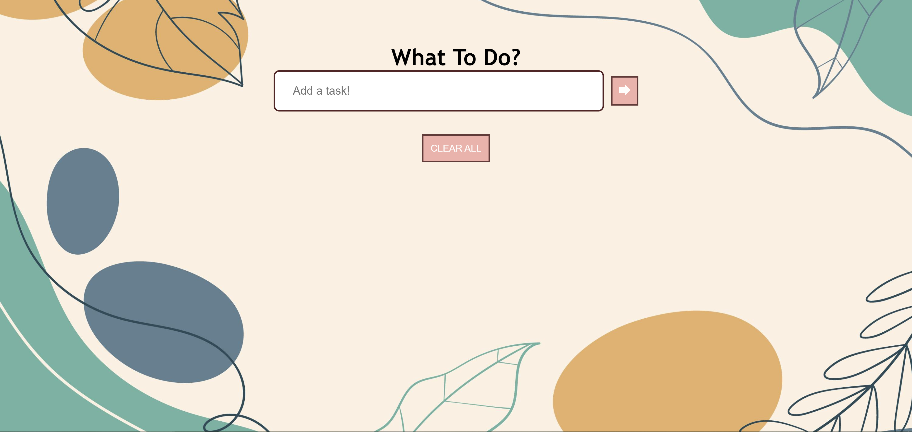
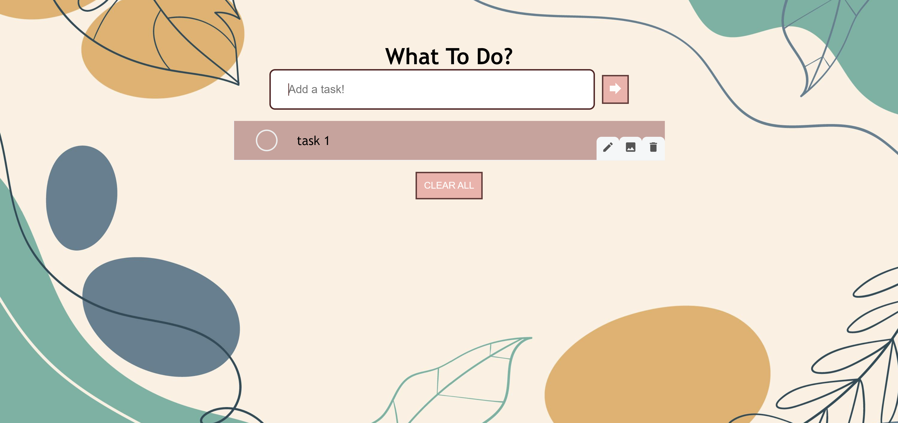
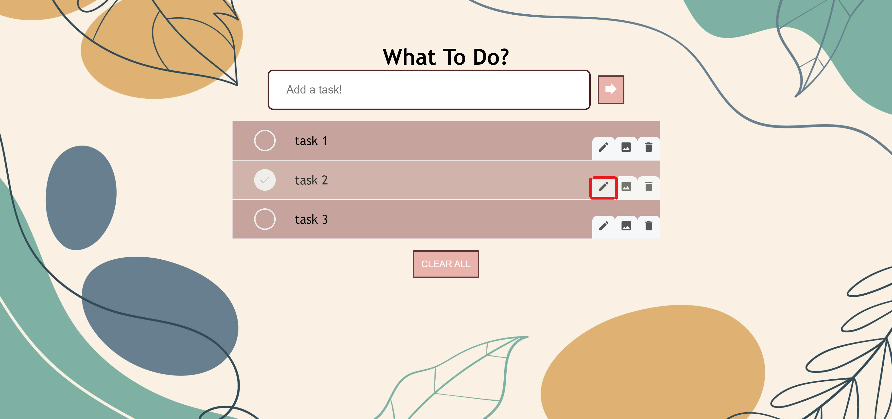
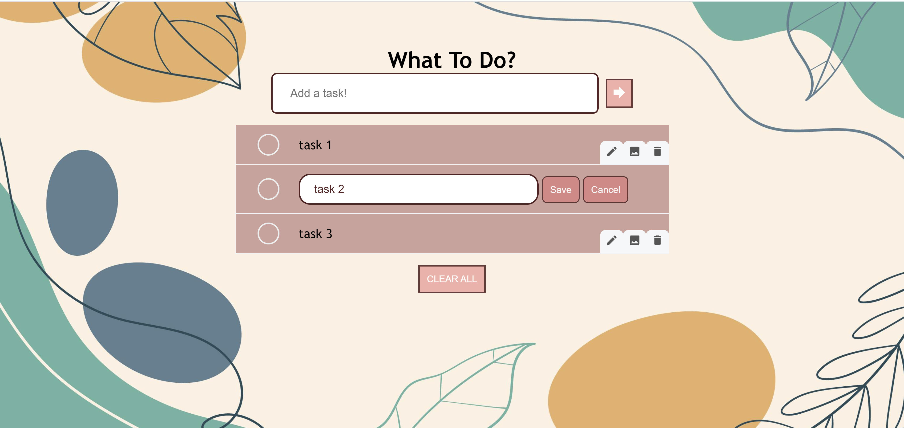
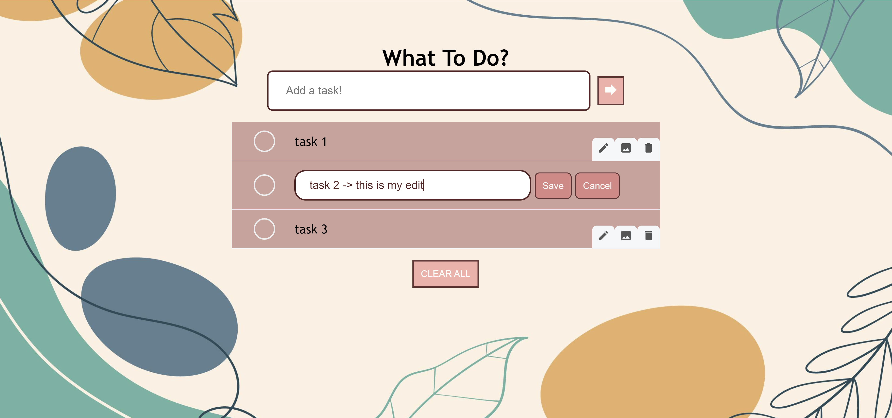
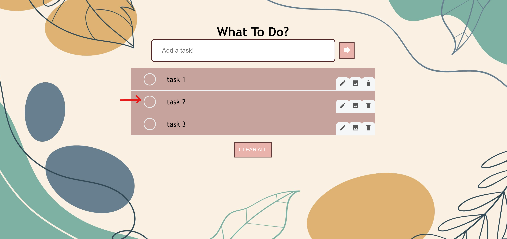
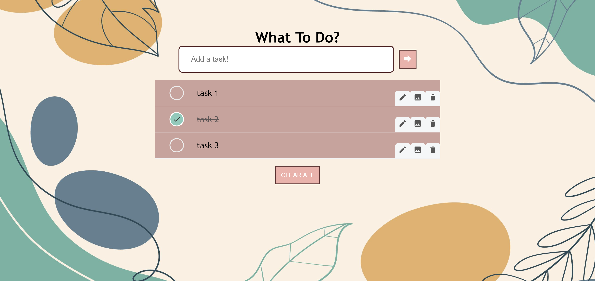
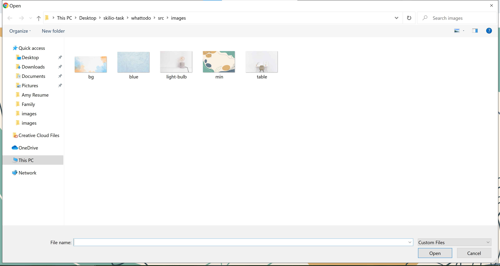
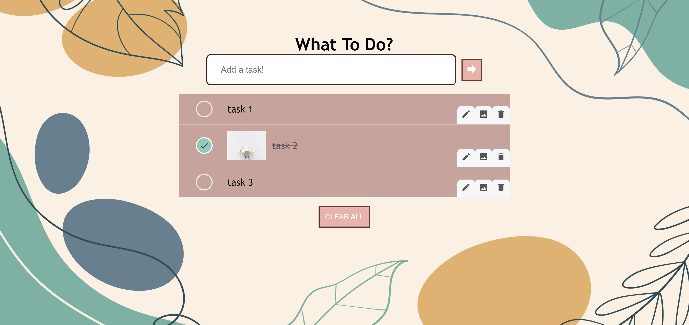

---
<h3>Table of Contents</h3>
* Table of Contents
{:toc}

--------------------------------------------------------------------------------------------------------------------
## Introduction

### WhatToDo’s User Guide

This user guide introduces to-do list web application, WhatToDo,
and provides support for the usage of its functionalities.

### About WhatToDo

**WhatToDo** is a **to-do list application** to help you keep track of tasks to do.
It **optimizes planning and organization of tasks** including **editing tasks, adding images and marking task completion** with a simple and clean graphical user interface (GUI).

--------------------------------------------------------------------------------------------------------------------
## Quick start
To get started using WhatToDo, simply head to the [website](https://amylzting.github.io/whattodo/).

This is what you will see when you first enter the site:

The functionalities available in the current version of WhatToDo are: 
1. Adding tasks
2. Deleting tasks
3. Editing tasks
4. Adding image to tasks
5. Marking tasks as complete
6. Clearing all tasks in list

Refer to the [Features](#features) section for more details of each functionality.

## Features
This section provides support for the features in WhatToDo.

### Adding a task
To add a task to the to-do list, type in your task into the text box which says "Add a task!" and click on the arrow button or press enter.

**Before input**:

**After input**:

**After enter**:

### Deleting a task
To delete a specific task on the to-do list, click on the delete icon as outlined below. 
Hovering over the delete icon will highlight it in red.

**Warning**: Clicking on delete icon will remove the task immediately. There is not undo in the current implementation of WhatToDo.

**Before click**:

**After click**:

### Deleting all tasks
To delete all tasks in the to-do list, click on the **CLEAR ALL** button at the bottom of the list.

**Before click**:

**After click**:

### Editing a task
To edit a specific task on the todo-list, click on the pen icon as outlined below. You should see a text input appear where you can edit the task description of the specific task. You will also see two buttons **Save** and **Cancel** beside the text input.

To save your changes, click the **Save** button.

To cancel your changes or cancel editing, click the **Cancel** button.

**Warning**: As a task cannot have no description, deleting the task description and pressing Save will not save the changes made. To delete the task, click on the delete icon instead.

**After clicking edit icon**:

**After entering input**:

Either save:

**After clicking Save**

Or cancel:
**After clicking Cancel**

### Marking a task as complete
To mark a task as complete, click on the circle checkbox beside the task description.
Clicking on it will turn it green and strike through the task description.

**Before clicking checkbox**:

**After clicking checkbox**:

### Adding an image to a task
To add an image to a specific task, click on the image icon. Then, choose your image file to display.

**Choose your image**:

**After image uploaded**:

